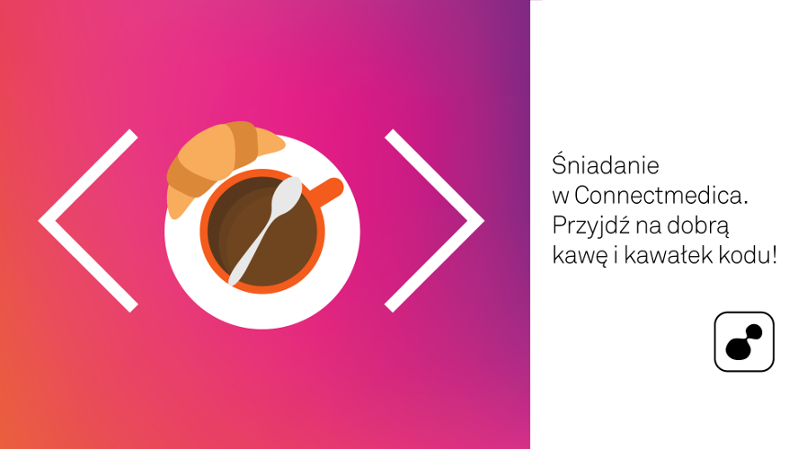

Blog
========================

Kod prostego bloga stworzonego w Symfony 2 podczas warsztatów organizowanych w ramach
śniadania w Connectmedica które odbyły się 28 listopada 2015.

[Slajdy z wykładów.](/slides/index.html)

Instalacja
------------------------

```
$ php composer.phar install
$ php app/console doctrine:schema:update --force
$ php app/console doctrine:fixtures:load
```


